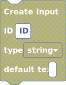
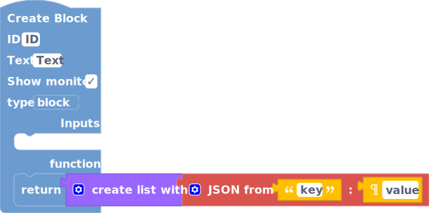

# Version 4.1.1
- made changing the renderer in the docs non blocking so you can still scroll and read the docs while it changes the images
- fixed the issue with rendering a disabled block to an svg  
  
## :warning: Braking Changes
- None :thumbsup:
# Version 4.1.0
- added a button that lets you view and copy the code instead of just downloading it
- fixed bug with updating extensions
- added the ability for extensions to register types to output shapes
- fixed an issue with how extensions are loaded
- added an animation to the copy button
- added another output shape that extensions can use
## :warning: Braking Changes
- None :thumbsup:
# Version 4.0.0
- added blog page
- redid the entire UI
- added the ability to use the system theme instead of just light and dark
- added the ability to change the block renderer at runtime and made the docs reflect the renderer you chose
    - Thrasos(what PenguinBuilder used to use in the first versions)  
      
    - Zelos(what PenguinBuilder eventually switched to using)  
      
    - Zeus(an extended version of Zelos that PenguinBuilder now uses, just adds new output shapes)  
    
- added the ability to export the workspace to svg and json, the json is primarily used for the docs, so that it can match the renderer that the user has set, and is not the same as the save file
- change the save file format, which makes it not compatible with 3.x.x
- made the extension api allow more stuff with colors
- changed how the JSON blocks are handled
- removed the function expression related blocks
- removed the comment blocks
## :warning: Breaking Changes 
- the save format is not compatible with the older 3.x.x format
